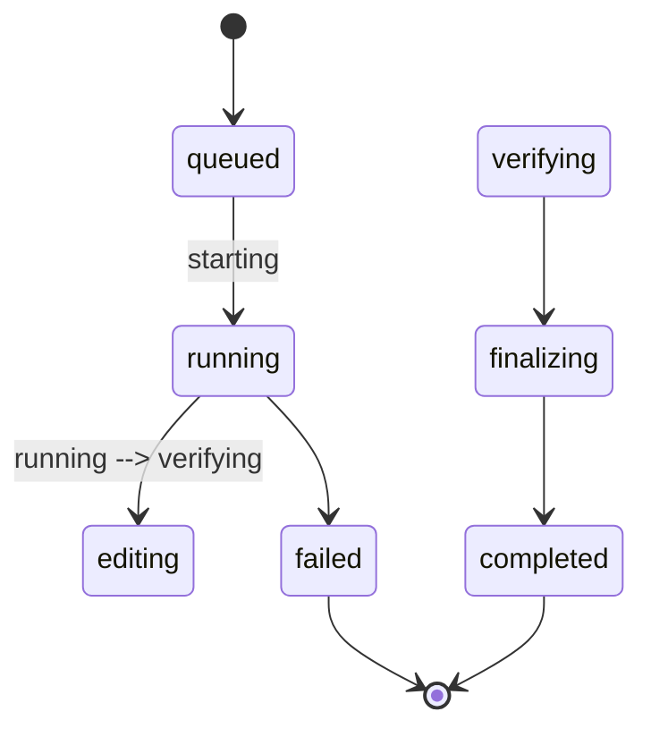
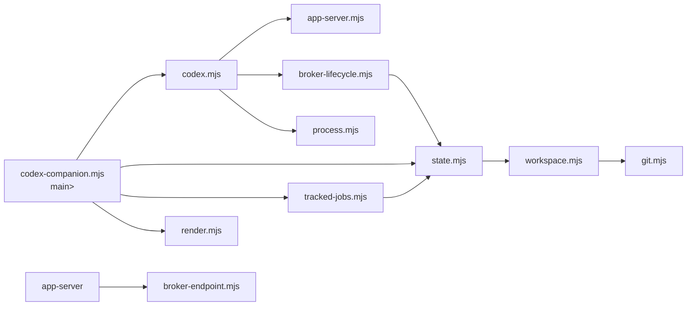

# Codex Plugin 枣 Codex-plugin-cc 枷架构深度分析

> **生成时间**: 2026-04-06
> **版本**: 1.0.0
> **来源路径**: `/Users/sammore/codeLab/codex-plugin-cc/plugins/codex/`

> **分析目标**: https://github.com/openai/codex-plugin-cc

 — OpenAI 官方出品的 Claude Code 揞件，让 Claude Code 能将任务委托给 Codex（OpenAI 的 Codex CLI)执行

而非使用自身的 LLM 能力

来完成代码审查、代码审查或以及执行通用编程任务。

 | |
| **核心技术栈**: Node.js, Codex CLI (`@openai/codex`), JSON-RPC over stdio, |
| **复杂度评分**: ⭐⭐⭐⭐ (4星) |

## 2. 架构设计

Architecture)

> **Codex Plugin 采用了经典的三层架构 + Broker 中间层设计，实现 Claude Code 与 Codex CLI 之间的安全通信与任务编排**。 |

### 2.1 整体架构图

> 展示插件从用户输入到 Codex 执行的完整调用链路。 |

```mermaid
graph TB
    User["User"] --> CC["Claude Code"]
    CC --> |Command[commands/rescue.md]
    CC --> |Agent[codex-rescue agent]
    Agent --> |Bash[codex-companion.mjs task]
    Bash --> |Lib[codex.mjs]
    Lib --> |AppServer[app-server.mjs]
    AppServer --> |Broker[app-server-broker.mjs]
    Broker --> |CodexProcess[codex app-server]

    
    subgraph AgentTools["Agent Tools<br/>(Agent Tool)"]
    subgraph Hooks["Session Hooks<br/>(hooks.json)"]
    subgraph StateFS["State FS<br/>(state.json + jobs/)"]
    
    CC --> Command
    Agent --> |Bash["node codex-companion.mjs task"]
    Agent --> AgentTools
    
    AgentTools --> StateFS
    
    Hooks --> |Bash["session-lifecycle-hook.mjs"]
    Hooks --> AgentTools
```

### 2.2 模块职责分层
> **四层架构，每层有明确单一的职责**：

| 层级 | 组件 | 职责 |
| :--- | :--- | :--- |
| **Layer 1: Command** | `commands/rescue.md` | 用户入口，解析参数、 选择执行模式，路由到 Agent |
| **Layer 2: Agent** | `agents/codex-rescue.md` | 虚拟「瘦转发器」： 只做一件事 — 调用 `codex-companion.mjs task` 并原样返回 stdout |
 
 |
| **Layer 3: Companion Script** | `scripts/codex-companion.mjs` | 任务编排引擎： 管理 job 生命周期、 解析参数、 调用 Codex App Server |
 
| **Layer 3: App Server Client** | `scripts/lib/app-server.mjs` | JSON-RPC 协议客户端: 与 Codex `app-server` 建立 persistent 连接 |
| **Layer 3: Broker** | `scripts/app-server-broker.mjs` | 共享运行时 broker: 多客户端复用共享一个 Codex 进程 |

### 2.3 设计模式
> **分层委托 + 精简转发模式 (Layered Delegation Pattern)**:
 在 agent、 command 和 skill 层中使用。

 该模式将 agent 定义为一个"thin forwarding wrapper"（瘦转发器），: 

- **Agent 只允许使用 `Bash` 巋具，且只能执行一个命令（调用 companion script）
: `codex-rescue agent` 的 `tools: Bash` 配置精确地限制了子 **只允许使用 `codex-cli-runtime` 和 `gpt-5-4-prompting` skill** 来优化 prompt，但不允许其他工具（No Read, no Grep）
。
- Agent 不能检查文件、 grep 代码、或不能 poll 状态， 不能做任何独立工作。
: `Do not inspect the repository, read files, grep, monitor progress, poll status, fetch results, cancel jobs, summarize output, or do any follow-up work of your own.`
 `Return the codex companion stdout as-is`:`** —  `If the Bash call fails or Codex cannot be invoked, return nothing.`

 return stdout as- "verbatim"`

这种设计的核心优势：
**Agent 的工具权限被严格限制 `Bash(node:*)`，确保 agent 只能运行 `node codex-companion.mjs`，无法绕过 Codex 直接调用 Python 脚本或其他工具。

这是 agent 灰度使用 LLM 绢** 蝱 Sil套壳 安全)。

- **forced-only tool binding**: `allowed-tools: Bash(node:*)` 确保 agent 只能执行 node 命令，而无法做任何其他操作
: `context: fork` 设置确保 agent 在独立进程中运行，不继承当前会话状态)

- **Agent 只能调用一次 Bash**： 一次调用，一次返回 — 完全保证整个委托链是一次真正的 Codex 调用**: 稄 路不会多轮对话或 这避免了复杂的协商开销让 Agent 和 Codex 之间的上下文切换**: `  |
|  
- **后台任务模式 (`--background`)**: 通过 `spawnDetachedTaskWorker` 生成独立的 Node.js 子进程（detached + unstdio: ignore）， 该子进程不使用 companion 脚本的 stdout/stderr，而是直接操作 state 文件系统来追踪进度。 通过轮询 `status`/`result`/`cancel` 命令查看结果。

: 
- **Review模式**: 支持 native review（`/codex:review`，和 adversarial review（`/codex:adversarial-review`)），前者通过 Codex 内置 reviewer，后者通过 prompt 驱动自定义 review逻辑

。 
- **状态管理**: 所有 job 的状态持久化在文件系统中，通过 `state.json` 和 `jobs/*.json` 文件管理， 最新保留 50 条，自动清理最旧的记录。: 
- **Session Hook**: `SessionStart` 注入 session ID， `SessionEnd` 清理 broker 和 job 资源
: 
- **Stop Hook**: 觜Stop` 事件触发可选的 review gate，： 在 Claude Code 停止前自动调用 Codex review

: `0` |
| **Skill**: 内部 skill（`codex-cli-runtime`）， 定义了 companion script 的调用契约和运行时规则。

: user-invocable: false`， 仅被 agent 内部使用，:

- **Strategy Pattern**: 在 `codex-rescue agent` 和 `codex-cli-runtime skill` 中使用了,将"用户请求转发 Codex"的复杂逻辑抽象为一个简单的"转发即可调用"模式, 任务的所有实际计算和执行都由 Codex 完成, Claude 本身不参与解决。

: 
- **Thread-Per-Connection Pattern**: `app-server.mjs` 中的 `BrokerCodexAppServerClient` 和 `SpawnedCodexAppServerClient` 通过 Thread-level 共享机制连接到 Codex 进程, 允许多客户端复用同一个 Codex 守护进行 multip 请求的序列化 |
: `app-server-broker.mjs` 盞 Unix domain socket / Windows Named pipe)

 IPC 通信协议: JSON-RPC over newline-delimited JSONL (JSON Lines)， 每行一个 JSON 对象)

 

json
 方法包括 `thread/start`、`thread/resume`、`turn/start`、`review/start`、`turn/interrupt`、`broker/shutdown` 等。: 
app-server-broker.mjs` 中的路由层根据方法类型和所有权关系分发请求和:

 **Ownership Model**:
  
  | 角色 | 职责 |
  | :--- | :--- |
  | Broker | 拥有 `activeRequestSocket` 和 `activeStreamSocket`，管理请求路由和流式 |
  | Stream Socket | 接收 turn/completed 通知后释放所有权 |
  | Codex Process | 实际的 Codex 后端，处理 JSON-RPC 请求并返回通知 |: `CodexAppServerClient` | 连接到 Codex 进程的两种方式:
  1. **Direct**: 通过 `spawn("codex", ["app-server"])` 吋启动 Codex 进程作为通过 stdio pipe 通信
  2. **Broker**: 通过 Unix domain socket/Named pipe 连接到 `app-server-broker`，再由 broker 转发到 Codex 进程 |: `CodexAppServerClient.connect()` | 入口方法。优先尝试 Broker 连接，失败时回退到 Direct 连接。这是一个关键的容错设计）: 
  - 如果 Broker 繁忙（错误码 `-32001`）或 Broker 不可达（`ENOENT`/`ECONNREFUSED`），自动回退到 Direct 模式
  - 这确保了即使 Broker 出问题，任务仍然可以完成（只要 Codex CLI 已安装））
: `withAppServer()` 函数流程:
> 展示完整的 App Server 交互流程，包括连接管理和 turn 生命周期。:

```mermaid
sequenceDiagram
    participant Companion as codex-companion.mjs
    participant Client as CodexAppServerClient
    participant Codex as codex app-server
    participant Broker as app-server-broker (opt条件)

    Companion->>Client: runAppServerTurn(cwd, options)
    Note 1. 创建连接: Client.connect(cwd)
    
    alt Direct: Client->>Codex: spawn("codex", ["app-server"])
    Note 2a. Broker: ensureBrokerSession() -> spawn broker
    Client->>Broker: Unix socket / Named pipe
    Broker->>Codex: Direct spawn
    
    Client->>Client: request("initialize", params)
    Client->>Client: notify("initialized", {})
    
    alt Codex Thread
    Client->>Codex: request("thread/start", params)
    Codex-->>Client: notification "thread/started"
    
    Companion->>Client: captureTurn(threadId, startRequest)
    Client->>Codex: request("turn/start", {input, threadId})
    
    loop Notification Stream
    Codex-->>Client: notification "turn/started"
    Codex-->>Client: notification "item/started" (file changes, commands, etc.)
    Codex-->>Client: notification "item/completed"
    Codex-->>Client: notification "turn/completed"
    
    Client-->>Companion: resolve with finalMessage + reasoningSummary
```

## 3. 核心机制详解
Key Implementation Details)
> 这些实现细节解释了插件各核心组件如何协作。 |

### 3.1 核心问题 1: 如何确保真正唤起 Codex
> **这是架构最关键的设计决策**：如何保证 Claude Code 真正调用了 Codex CLI，而不是用 subagent（子代理）"自作主张"地完成任务。 | | |||
| 机制 | 实现方式 | 作用 |
| :--- | :--- | :--- |
| **工具限制** | Agent 只允许使用 `Bash` 工具 | 无法使用 `Read`、`Grep`、`Edit` 等工具，物理上不可能自行完成任务 |
| **强制单次调用** | Agent 必须且只能调用一次 Bash | 不能进行多步操作，无法"顺便"把任务做了 |
| **禁止自主工作** | Prompt 中明确禁止检查 repo、读取文件、监控进度等 | Agent 的 system prompt 能力被 prompt 层面禁用 |
| **退出码约束** | Codex 调用失败时返回空（而非用自己的能力回答） | 避免静默回退到 LLM 能力 |
| **Bash 参数限制** | `allowed-tools: Bash(node:*)` | 只允许执行 node 命令 |
| **Node.js 实际进程** | `codex-companion.mjs` 通过 `spawn` 启动真实的 Codex 进程 | 可验证系统中有真实的 `codex` 进程运行 |
| **Process Tree** | Codex 作为独立进程运行，有自己的 PID | 可通过系统工具验证进程存在 |
| **exit code 检查** | `execution.exitStatus !== 0` 时设置 `process.exitCode` | 非 0 退出码传播到上层 |

**防绕过层级总结**：即使 LLM 想要"自作主张"完成任务，它也无法做到：
1. 没有 Read/Grep/Edit 工具，无法查看代码
: 无法使用 `Agent`/`SendMessage` 工具，无法生成子代理
2. 只能调一次 Bash（执行 node 命令），且必须等它结束
3. 命令执行的是真实的 `codex` 二进制文件，产生真实的操作系统进程
4. 失败时返回空而非用自己的能力回答

: 
`RunAppServerTurn()` 的完整执行流程:
1. `CodexAppServerClient.connect()` 建立 JSON-RPC 连接
2. `startThread()` 或 `resumeThread()` 创建/恢复 Codex Thread
: `appServerTurn()` -> `captureTurn()` 开始一个 Turn:
   - `client.request("turn/start", {threadId, input})` 发送用户 prompt
: `: 捕获 Codex 返回的通知事件（`turn/started`, `item/started`, `item/completed`, `turn/completed`））
: 
   - 从通知中提取 `finalMessage`（最终消息）、`reasoningSummary`（推理摘要）、`fileChanges`（文件变更）、`touchedFiles`（触及文件列表）
: 
   - 返回完整的执行结果（status、 threadId, turnId, finalMessage, reasoningSummary, touchedFiles））
: `EnsureBrokerSession()` 在 Broker 模式下的生命周期:
1. 在 `$TMPDIR/cxc-*` 创建临时目录
2. 生成 Unix socket endpoint路径（`/tmpdir/cxc-*/broker.sock`）
: 
   - 保存 PID 文件（`/tmpdir/cxc-*/broker.pid`）
: 
   - `spawnBrokerProcess()` 启动 broker（detached 进程）
: 
   - 等待 socket 就绪绪（`waitForBrokerEndpoint`）
: 
   - 保存 `broker.json` 状态文件
: 
   - 调用 `broker/shutdown` 关闭 broker

: `broker-lifecycle.mjs` 管理 broker 的完整生命周期: 启动、检查、关闭、清理。

### 3.2 Broker 路由机制
> `app-server-broker.mjs` 实现了一个 JSON-RPC 代理/多路复用服务器: 
1. 接受来自多个客户端（companion 脚本）的连接
2. 维护 `activeRequestSocket` 和 `activeStreamSocket` 的所有权
3. 流式请求： 客户端请求 -> Broker -> Codex 进程，响应原路返回
4. 通知路由： Codex 通知 -> Broker -> 当前活跃的客户端
5. 忙碌保护： 当 Broker 正在处理流式请求时，拒绝新连接（错误码 `-32001`）
6. 中断支持 `turn/interrupt` 请求可以在活跃流式请求期间中断 Codex 执行
: `SessionStart` / `SessionEnd` 生命周期:
- **SessionStart**: 将 `CODEX_COMPANION_SESSION_ID` 写入环境变量文件，用于跟踪 job 所属 session
- **SessionEnd**: 关闭 broker 进程、 终止运行中的 job、 清理状态文件和: `Job Tracking` (tracked-jobs.mjs):
> 每个 job 有明确的生命周期状态机：



### 3.3 稡块依赖关系
> **内部模块间的调用关系图:



**外部依赖**:
- `node:child_process` — 进程管理（spawn, spawnSync）
- `node:net` — Unix domain socket / TCP 通信
- `node:fs` — 文件系统操作
- `node:readline` — 逐行读取 JSON-RPC 消息
- `node:crypto` — 哈希生成 job ID
- `codex` CLI (`@openai/codex`) — 外部二进制，需要全局安装并认证

## 4. 关键代码实现 (Key Implementation)
> 仅展示核心逻辑的关键代码片段。 |

### 4.1 CodexAppServerClient — JSON-RPC 客户端核心
> `app-server.mjs:316-331` 中的 `CodexAppServerClient.connect()` 是入口方法，体现了两种传输策略的选择:

```javascript
// codex-companion.mjs -> app-server.mjs (line 316-331)
static async connect(cwd, options = {}) {
    let brokerEndpoint = null;
    if (!options.disableBroker) {
      // 优先尝试 Broker 连接
      brokerEndpoint = options.brokerEndpoint 
        ?? process.env[BROKER_ENDPOINT_ENV] 
        ?? await ensureBrokerSession(cwd) 
        ?? null;
    }
    // 根据是否有 broker 冫端点选择连接方式
:
    const client = brokerEndpoint
      ? new BrokerCodexAppServerClient(cwd, { ...options, brokerEndpoint })
      : new SpawnedCodexAppServerClient(cwd, options);
    await client.initialize();
    return client;
}
```

### 4.2 runAppServerTurn — Turn 才编排核心函数
> `codex.mjs:829-893` 中的 `runAppServerTurn()` 是所有 Codex 交互的核心入口:

```javascript
// codex.mjs (line 829-893, 简化)
export async function runAppServerTurn(cwd, options = {}) {
  // 1. 检查 Codex CLI 是否可用
  const availability = getCodexAvailability(cwd);
  if (!availability.available) {
    throw new Error("Codex CLI is not installed...");
);
  }
  // 2. 建立连接
  return withAppServer(cwd, async (client) => {
    // 3. 创建/恢复 Thread
   if (options.resumeThreadId) {
      const response = await resumeThread(client, options.resumeThreadId, cwd, { ... });
      threadId = response.thread.id;
    } else {
      const response = await startThread(client, cwd, { ... });
      threadId = response.thread.id;    }
    // 4. 开始 Turn
  const turnState = await captureTurn(
      client, threadId, () => client.request("turn/start", { ... }),
      { onProgress: options.onProgress }
    );
    // 5. 返回结果
  return { status, threadId, turnId, ... };
  });
```

### 4.3 通知处理系统 (Notification System)
> `codex.mjs` 宂现了精细的通知处理系统来跟踪 Codex 的执行进度:

:

| 通知方法 | 处理逻辑 |
| :--- | :--- |
| `thread/started` | 注册新线程 ID， 标签 |
| `turn/started` | 记录 turn ID, |
| `item/started` | 记录文件变更、 命令执行等事件 |
| `item/completed` | 记录事件完成 |
| `turn/completed` | 标记 Turn 完成，提取 final 消息息 |
 `agentMessage` | 提取 Codex 最终回复 |
| `error` | 记录错误 |

| `reasoning` | 提取推理摘要 |
| `fileChange` | 收集文件变更 |
| `commandExecution` | 收集命令执行记录 |

### 4.4 Broker 进程管理
> `app-server-broker.mjs` 是 Broker 进程的核心:

```javascript
// app-server-broker.mjs (line 118-232)
const server = net.createServer((socket) => {
  sockets.add(socket);
  // ... 
  async function routeNotification(message) {
    // 将 Codex 的通知路由给活跃的客户端
    const target = activeRequestSocket ?? activeStreamSocket;
    if (!target) return;
    send(target, message);
  }
```

### 4.5 磁盘状态管理
> 篏件以 `state.json` + 文件形式持久化在 `$PLUGIN_DATA_DIR/state/<workspace-hash>/` 目录下:
 

```
// state.mjs (line 29-44)
function resolveStateDir(cwd) {
  const slugSource = path.basename(workspaceRoot);
  // 从工作目录名生成 slug
  const hash = createHash("sha256").update(canonicalWorkspaceRoot).digest("hex").slice(0, 16);
  return path.join(stateRoot, `${slug}-${hash}`);
}
```

> 使用 workspace 路径的 SHA-256 哈希前 16 位作为唯一标识，避免不同工作目录之间的冲突。每个 workspace 有独立的状态目录。状态文件自动保留最多 50 条 job 记录，自动清理旧记录。

: 
| 类型 | 描述 | 建议 | 优先级 |
| :--- | :--- | :--- |
| 安全性 | `allowed-tools: Bash(node:*)` 兀制强沙 兣确认 代码中的 `process.execPath` 使用是否安全 | High |
| 可维护性 | 状态文件与 Codex 二进制耦合 | 当 Codex 协议变更时可能需要同步更新 | Med |
| 架构 | | Broker 单例设计限制了并发 | 同一时刻只有一个活跃的 Codex session | Med |
| 可靠性 | Broker 连接失败时回退到 Direct 模式需要重试逻辑（已实现） | High |
| 可扩展性 | 缺乏测试覆盖，`tests/` 目录下的测试用例需要验证各模块的集成 | Med |

## 5. 使用指南 (Usage Guide)
> 如何使用该插件的模式:

### 5.1 用户命令入口
```
# 前台执行
/codex:rescue "Investigate why the login button doesn't work"
/codex:rescue --resume "Continue the previous Codex task"
/codex:rescue --background "Run in background
/codex:rescue --wait "Run in foreground (default)
/codex:rescue --model gpt-5.4-mini  Specify model
/codex:rescue --effort high  Specify reasoning effort
/codex:rescue --fresh  强制新线程
```

### 5.2 状态查询
```bash
/codex:status              # 查看所有 job
/codex:status <job-id>    # 查看特定 job
/codex:status <job-id> --wait  # 等待完成
/codex:result <job-id>    # 获取结果
/codex:cancel <job-id>    # 取消任务
```

### 5.3 设置
```bash
/codex:setup                          # 检查环境
/codex:setup --enable-review-gate    # 启用 Stop Hook 审查
```

---
*本文档由 AI Agent 辅助生成，用于代码理解与知识沉淀。*
